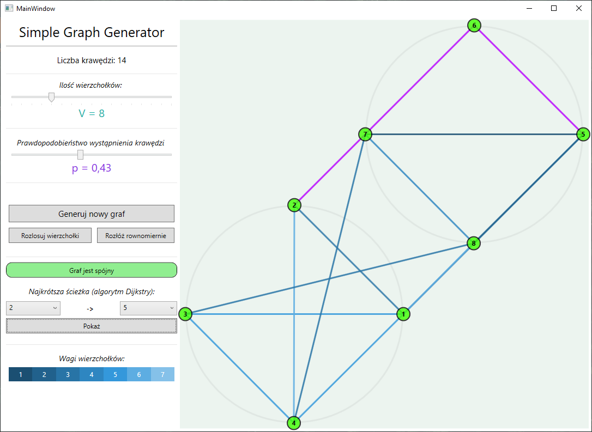
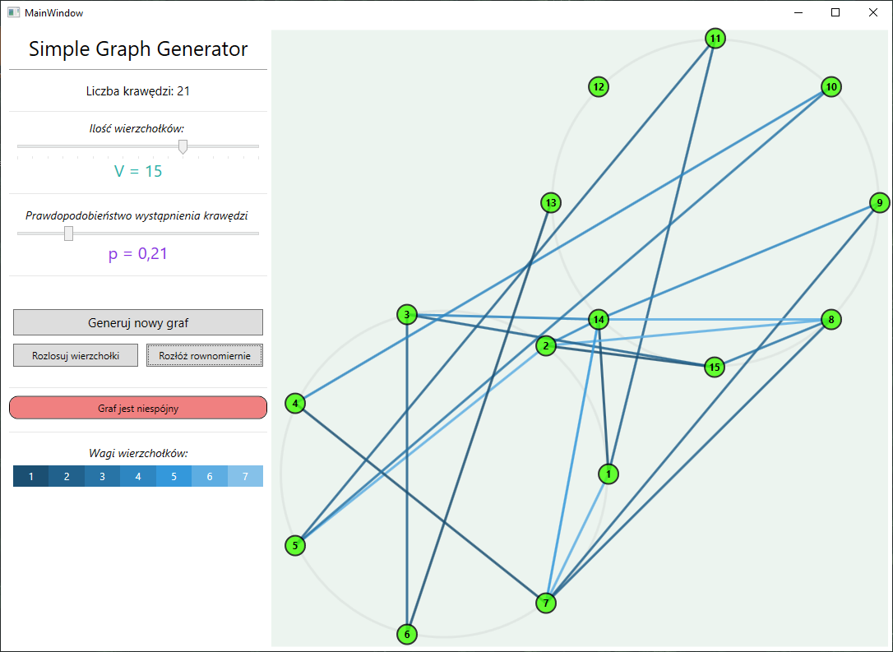
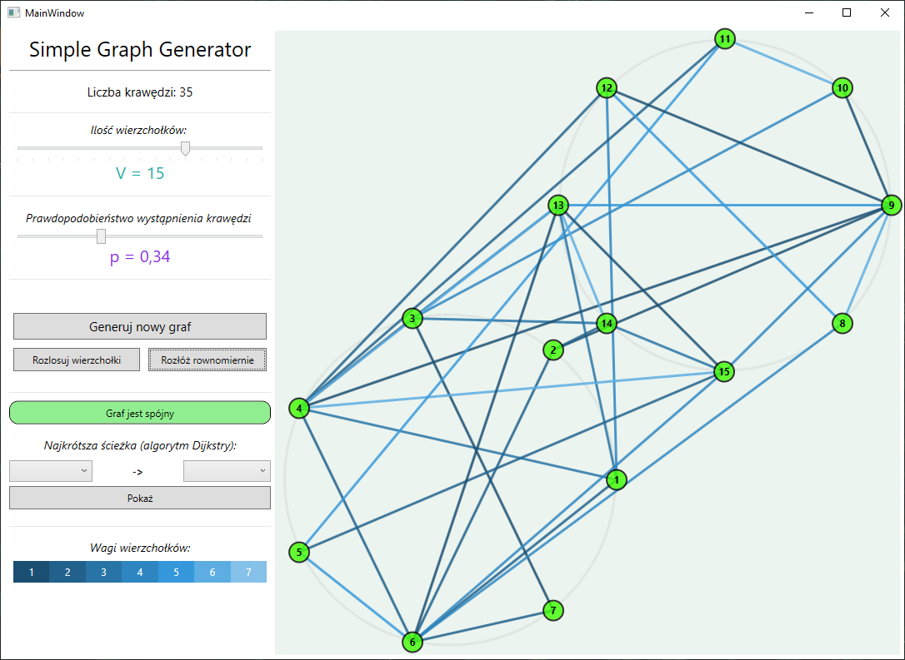
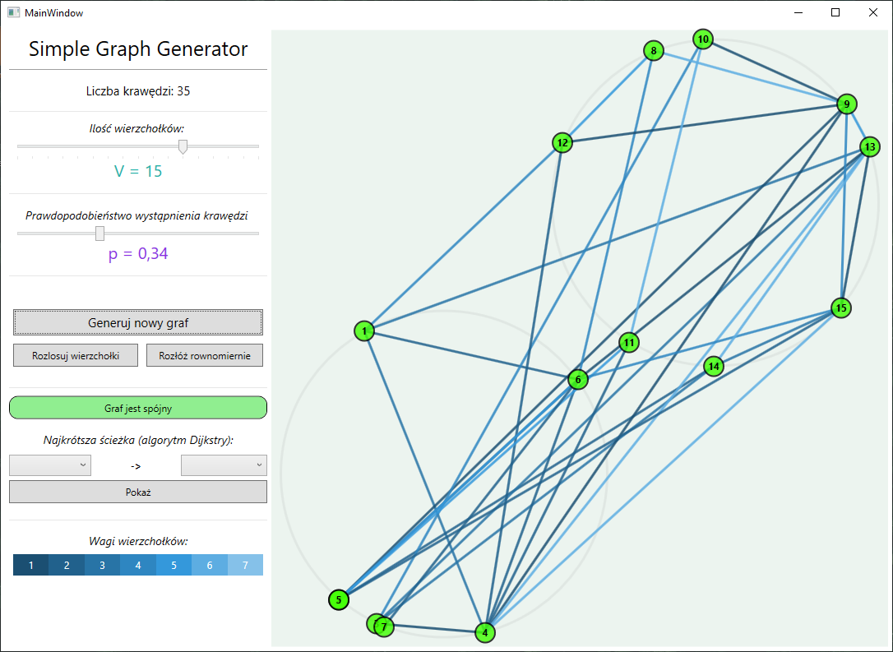

# Simple Graph Generator

Projekt na zaliczenie przedmiotu AUTG(Algorytmiczne Ujęcie Teori Grafów)

## Screenshots
..
- - -
## Download
Windows bin:
[SimpleGraphGenerator v1.2](https://github.com/mcw256/Simple-Graph-Generator/releases/download/v1.2/SimpleGraphGenerator.exe)

